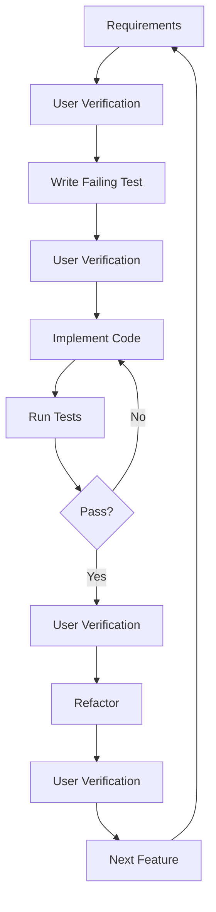

# 🚀 Claude-Driven Full-Stack Development System

A comprehensive framework for building full-stack applications with Claude, emphasizing Test-Driven Development (TDD), continuous verification, and always-functional code.

## 📋 Overview

This system combines the patterns from [claude-workshop-live](https://github.com/johnlindquist/claude-workshop-live) with enterprise-grade software development practices to ensure:

- ✅ **Always-functional code** between interactions
- 🧪 **Test-driven development** at every step
- 👁️ **User verification** checkpoints
- 📊 **Progress tracking** through artifacts
- 🔄 **Incremental development** with rollback capability

## 🏗️ System Components

### Core Files
- **`MASTER_PROMPT.md`** - The main prompt template for Claude interactions
- **`CLAUDE.md`** - Project-specific configuration and state tracking
- **`TDD_WORKFLOW.md`** - Comprehensive TDD guidelines and practices
- **`.claude/`** - Automation hooks, artifacts, and tool configurations

## 🎯 Quick Start

### 1. Initialize Your Project

```bash
# Copy this system to your project directory
cp -r /path/to/SolutioningWithClaude/.claude .
cp MASTER_PROMPT.md CLAUDE.md TDD_WORKFLOW.md ./

# Make hooks executable
chmod +x .claude/hooks/*.sh
```

### 2. Start a Claude Session

Begin your interaction with Claude using this prompt:

```markdown
Hey Claude, I want to build a [project type] using the TDD approach defined in MASTER_PROMPT.md. 

Please:
1. Review the MASTER_PROMPT.md for our development methodology
2. Check CLAUDE.md for project-specific configuration
3. Use the TDD_WORKFLOW.md for testing practices
4. Track progress using the artifact system in .claude/

Let's start with [specific feature/requirement].
```

### 3. Example: C# MAUI Audio Streaming Project

```markdown
Hey Claude, please create a new C# MAUI project for audio streaming with these requirements:

1. **Framework**: .NET 8 MAUI
2. **Platforms**: Android (primary), Windows (testing)
3. **Features**:
   - Real-time microphone capture
   - Stream audio to API endpoint
   - Integrate OpenAI Whisper for transcription
   - Show live transcription in UI

Please follow the TDD approach in MASTER_PROMPT.md and create the initial project structure with a failing test.
```

## 📁 Project Structure

```
YourProject/
├── MASTER_PROMPT.md           # Development methodology
├── CLAUDE.md                  # Project state and config
├── TDD_WORKFLOW.md           # Testing guidelines
├── .claude/
│   ├── hooks/
│   │   ├── pre-implementation.sh
│   │   ├── verify-build.sh
│   │   └── post-test.sh
│   ├── artifacts/
│   │   ├── current-state.json
│   │   ├── checkpoint.json
│   │   └── test-results/
│   └── mcp-tools/
│       └── test-runner.json
└── src/
    └── [Your project files]
```

## 🔄 Development Workflow

### The Verification Loop



### Key Commands

```bash
# Before starting new work
./.claude/hooks/pre-implementation.sh

# Verify build status
./.claude/hooks/verify-build.sh

# After running tests
./.claude/hooks/post-test.sh

# Check current state
cat .claude/artifacts/current-state.json | jq

# View test results
cat .claude/artifacts/test-results/latest.json | jq
```

## 🎯 Best Practices

### 1. Always Start with a Test
```csharp
[Test]
public void NewFeature_ShouldBehaviorDescription()
{
    // Arrange
    // Act
    // Assert
    Assert.Fail("Not implemented");
}
```

### 2. Verification Points
Never skip these checkpoints:
- ✅ After requirements gathering
- ✅ After test creation
- ✅ After implementation
- ✅ After refactoring

### 3. Maintain Functional State
```bash
# Always ensure tests pass before new work
dotnet test
# If tests fail, rollback to last checkpoint
git checkout .claude/artifacts/checkpoint.json
```

## 🛠️ Customization

### Modify Hooks
Edit `.claude/hooks/*.sh` to match your project's build and test commands.

### Update MCP Tools
Modify `.claude/mcp-tools/test-runner.json` for custom test strategies.

### Extend CLAUDE.md
Add project-specific sections:
- API endpoints
- Environment variables
- Deployment configurations
- Team conventions

## 📊 Progress Tracking

### View Current Milestone
```bash
cat .claude/artifacts/current-state.json | jq '.milestones'
```

### Check Test History
```bash
ls -la .claude/artifacts/test-results/history-*.json
```

### Generate Coverage Report
```bash
dotnet test --collect:"XPlat Code Coverage"
reportgenerator -reports:TestResults/*/coverage.cobertura.xml -targetdir:CoverageReport
```

## 🚨 Troubleshooting

### Tests Failing After Claude's Changes
1. Check the last checkpoint: `cat .claude/artifacts/checkpoint.json`
2. Review test output: `cat .claude/artifacts/test-results/latest-output.txt`
3. Rollback if needed: `git checkout [last-working-commit]`

### Build Not Working for Target Platform
1. Verify platform setup: `./.claude/hooks/verify-build.sh`
2. Check CLAUDE.md for platform-specific notes
3. Review build output for missing dependencies

### Claude Not Following TDD Process
Remind Claude:
```markdown
Please review MASTER_PROMPT.md section 2 (TDD Workflow). 
We need to create a failing test first before implementing any code.
```

## 🤝 Integration with Claude

### Starting a Session
```markdown
Load context from:
- MASTER_PROMPT.md (methodology)
- CLAUDE.md (project state)
- .claude/artifacts/current-state.json (progress)
```

### Delegating to Sub-Agents
```markdown
Please use Sonnet to evaluate the test coverage of [file].
Context: We need to ensure 80% coverage for unit tests.
```

### Requesting Verification
```markdown
I've implemented [feature]. Please run:
`dotnet test --filter "Category=Unit"`
And confirm all tests pass before we continue.
```

## 📚 Additional Resources

- [NUnit Documentation](https://docs.nunit.org/)
- [MAUI Documentation](https://docs.microsoft.com/en-us/dotnet/maui/)
- [TDD Best Practices](https://martinfowler.com/bliki/TestDrivenDevelopment.html)
- [Claude Workshop Live](https://github.com/johnlindquist/claude-workshop-live)

## 🎓 Example Projects

### Simple Console App
```markdown
Create a console calculator with TDD:
1. Add operation with tests
2. Subtract operation with tests
3. Error handling with tests
```

### Web API
```markdown
Build a REST API with TDD:
1. Health check endpoint
2. CRUD operations
3. Authentication
4. Integration tests
```

### MAUI Mobile App
```markdown
Create a todo list app:
1. Data model with tests
2. Local storage with tests
3. UI bindings with tests
4. Platform-specific features
```

## 📝 License

This framework is provided as-is for use with Claude AI assistant. Adapt and modify as needed for your projects.

## 🙏 Acknowledgments

- Inspired by [claude-workshop-live](https://github.com/johnlindquist/claude-workshop-live)
- Built for Claude AI by Anthropic
- TDD practices from the software engineering community

---

**Remember**: Every line of code should have a purpose, a test, and user verification. 🚀