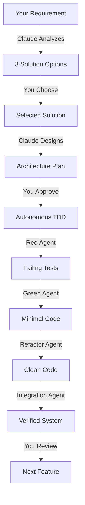

# 🚀 Autonomous TDD Solution Architecture System

A sophisticated framework for collaborative solution design with autonomous Test-Driven Development execution through specialized AI sub-agents.

## 🎯 What Makes This Different

This system revolutionizes development by:
- **Presenting exactly 3 architectural solutions** for every requirement
- **Automating the entire TDD cycle** through specialized Sonnet sub-agents
- **Maintaining 100% functional code** between all interactions
- **Balancing human decision-making** with AI implementation

## 🔄 The Core Workflow



## 🏗️ System Components

### Core Files
- **`MASTER_PROMPT_V2.md`** - The enhanced system prompt with 3-solution architecture
- **`CLAUDE.md`** - Project-specific configuration and state tracking
- **`QUICK_START.md`** - Detailed usage examples and patterns
- **`.claude/`** - Automation hooks, specialized agents, and tool configurations

## 🎯 Quick Start

### 1. Initialize Your Project

```bash
# Copy this system to your project directory
cp -r /path/to/SolutioningWithClaude/.claude .
cp MASTER_PROMPT_V2.md CLAUDE.md QUICK_START.md ./

# Make hooks executable
chmod +x .claude/hooks/*.sh

# Verify setup
./verify-setup.sh
```

### 2. Start Claude with the System

```markdown
Load MASTER_PROMPT_V2.md and CLAUDE.md. 
I need to build [your project description].
```

### 3. Experience the Workflow

Claude will:
1. Present 3 architectural approaches
2. Wait for your selection (1, 2, or 3)
3. Design the chosen architecture
4. Autonomously implement via TDD
5. Report back with tested, working code

## 💡 Example Interaction

### You Say:
```markdown
I need a real-time chat feature for my app
```

### Claude Responds:
```markdown
## Requirement: Real-time Chat Feature

### 🔵 Solution 1: WebSocket with Socket.io
**Approach**: Traditional WebSocket implementation
**Pros**: Mature, well-documented, extensive community
**Cons**: Requires sticky sessions, complex scaling
**Complexity**: Medium

### 🟢 Solution 2: Server-Sent Events ⭐ Recommended
**Approach**: SSE for receiving, REST for sending
**Pros**: Simple, proxy-friendly, auto-reconnect
**Cons**: One-way communication, less real-time
**Complexity**: Low

### 🟡 Solution 3: WebRTC P2P
**Approach**: Direct peer connections
**Pros**: True real-time, reduced server load
**Cons**: Complex NAT traversal, browser compatibility
**Complexity**: High

Please select: 1, 2, or 3?
```

### You Select:
```markdown
1
```

### Claude Executes:
```markdown
Implementing WebSocket solution with Socket.io...

🔴 RED: Creating 28 comprehensive tests...
🟢 GREEN: Implementing minimal code...
🔵 REFACTOR: Improving code quality...
✅ INTEGRATION: All systems verified!

Results:
- 28/28 tests passing
- 92% code coverage
- Average latency: 15ms
- Ready for production

Would you like to add user presence indicators?
```

## 📁 System Structure

```
YourProject/
├── MASTER_PROMPT_V2.md      # Core system prompt
├── CLAUDE.md                # Project-specific configuration
├── QUICK_START.md           # Usage examples
├── .claude/
│   ├── agents/              # Specialized sub-agents
│   │   ├── solution-architect.md
│   │   ├── red-agent.md
│   │   ├── green-agent.md
│   │   └── refactor-agent.md
│   ├── hooks/               # Automation scripts
│   │   ├── autonomous-tdd.sh
│   │   ├── pre-implementation.sh
│   │   ├── verify-build.sh
│   │   └── post-test.sh
│   ├── artifacts/           # Progress tracking
│   │   ├── current-state.json
│   │   └── tdd-checkpoint.json
│   └── mcp-tools/          # Tool orchestration
│       ├── solution-selector.json
│       └── test-runner.json
└── src/                     # Your actual code
```

## 🎭 The Sub-Agent Team

| Agent | Role | Specialty |
|-------|------|-----------|
| **Solution Architect** | Present 3 options | Strategic design choices |
| **Red Agent** | Create failing tests | Comprehensive test coverage |
| **Green Agent** | Minimal implementation | Just enough to pass |
| **Refactor Agent** | Code improvement | Quality without breaking |
| **Integration Agent** | System verification | End-to-end validation |

## 🛠️ Commands Reference

### Testing
```bash
dotnet test                                    # Run all tests
dotnet test --filter "Category=Unit"          # Unit tests only
dotnet test --filter "FullyQualifiedName~Chat" # Specific feature
./.claude/hooks/autonomous-tdd.sh             # Full TDD cycle
```

### Building
```bash
dotnet build                                   # Build solution
dotnet build -f net8.0-android                # Android build
dotnet build -f net8.0-windows10.0.19041.0   # Windows build
```

### Development
```bash
dotnet watch run                               # Hot reload
dotnet new maui -n ProjectName                # New MAUI project
dotnet add package PackageName                # Add NuGet package
```

## 🎯 Best Practices

### For Requirements
- **Be specific** about functionality
- **Include constraints** (performance, platforms, etc.)
- **Mention preferences** if you have them

### For Selection
- **Consider long-term** maintenance
- **Balance complexity** with requirements
- **Trust the recommendations** (usually option 2)

### For Review
- **Check test coverage** before proceeding
- **Verify key scenarios** are tested
- **Request changes** if needed

## 🔧 Customization

### Modify Agent Behavior
Edit files in `.claude/agents/` to adjust:
- Test generation patterns
- Implementation approaches
- Refactoring priorities

### Adjust Automation
Edit `.claude/hooks/` scripts for:
- Different test frameworks
- Custom build processes
- Deployment pipelines

### Configure Tools
Edit `.claude/mcp-tools/` for:
- Sub-agent delegation rules
- Parallel execution settings
- Timeout configurations

## 📊 Progress Tracking

```bash
# View current state
cat .claude/artifacts/current-state.json | jq

# Check TDD progress
cat .claude/artifacts/tdd-checkpoint.json | jq

# Monitor test results
ls -la .claude/artifacts/test-results/
```

## 🚨 Troubleshooting

### "Claude isn't presenting 3 options"
Remind Claude: "Please follow MASTER_PROMPT_V2.md and present exactly 3 solutions"

### "Tests are failing"
Check: `.claude/artifacts/test-results/latest-output.txt`

### "Build not working"
Run: `./.claude/hooks/verify-build.sh`

## 🎓 Philosophy

This system embodies three key principles:

1. **Choice Architecture**: Every decision gets exactly 3 well-differentiated options
2. **Autonomous Excellence**: TDD execution happens automatically via specialized agents
3. **Continuous Functionality**: Code always works between interactions

## 🤝 Contributing

To extend this system:
1. Add new agent types in `.claude/agents/`
2. Create new hooks in `.claude/hooks/`
3. Extend MCP tools in `.claude/mcp-tools/`

## 📚 Learn More

- [QUICK_START.md](QUICK_START.md) - Detailed examples
- [MASTER_PROMPT_V2.md](MASTER_PROMPT_V2.md) - Complete system specification
- [TDD_WORKFLOW.md](TDD_WORKFLOW.md) - Testing methodology details

## 🙏 Acknowledgments

Inspired by [claude-workshop-live](https://github.com/johnlindquist/claude-workshop-live) and the principles of Test-Driven Development.

---

**Remember**: You architect the solution, Claude presents options, Sonnet implements with TDD. This partnership creates better software, faster.