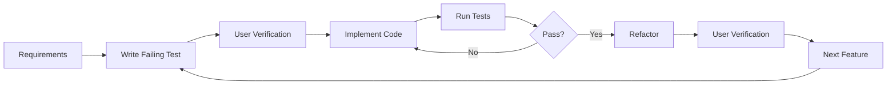

# Test-Driven Development Workflow

## 🔄 The TDD Cycle



## 📝 Step-by-Step Process

### 1️⃣ Requirements Phase
```markdown
**User Story**: As a [user], I want [feature] so that [benefit]

**Acceptance Criteria**:
- [ ] Criterion 1
- [ ] Criterion 2
- [ ] Criterion 3

**Technical Requirements**:
- Platform: [Android/Windows/iOS]
- Performance: [metrics]
- Security: [requirements]

🔍 **Verification**: Do these requirements match your expectations? (yes/no/modify)
```

### 2️⃣ Test Creation Phase
```csharp
// Example: Testing Audio Capture Initialization
[Test]
[Category("Unit")]
public async Task AudioCapture_Initialize_ShouldRequestPermissions()
{
    // Arrange
    var mockPermissions = new Mock<IPermissionService>();
    mockPermissions.Setup(p => p.RequestAsync(Permission.Microphone))
                   .ReturnsAsync(PermissionStatus.Granted);
    
    var audioCapture = new AudioCaptureService(mockPermissions.Object);
    
    // Act
    var result = await audioCapture.InitializeAsync();
    
    // Assert
    Assert.That(result, Is.True);
    mockPermissions.Verify(p => p.RequestAsync(Permission.Microphone), Times.Once);
}
```

**Commands to run**:
```bash
# Create test file
dotnet new class -n AudioCaptureServiceTests -o AudioStreamer.Tests/Unit/Services

# Run the test (should fail)
dotnet test --filter "FullyQualifiedName~AudioCapture_Initialize"
```

🔍 **Verification**: Test created and failing as expected? (yes/no/modify)

### 3️⃣ Implementation Phase
```csharp
// Minimal implementation to pass the test
public class AudioCaptureService : IAudioCapture
{
    private readonly IPermissionService _permissionService;
    
    public AudioCaptureService(IPermissionService permissionService)
    {
        _permissionService = permissionService;
    }
    
    public async Task<bool> InitializeAsync()
    {
        var status = await _permissionService.RequestAsync(Permission.Microphone);
        return status == PermissionStatus.Granted;
    }
}
```

**Commands to run**:
```bash
# Build the project
dotnet build

# Run the test again (should pass)
dotnet test --filter "FullyQualifiedName~AudioCapture_Initialize"
```

🔍 **Verification**: Test passing? Implementation correct? (yes/no/modify)

### 4️⃣ Refactoring Phase
```csharp
// Improved implementation with better error handling
public async Task<bool> InitializeAsync()
{
    try
    {
        // Check if permission already granted
        var currentStatus = await _permissionService.CheckStatusAsync(Permission.Microphone);
        if (currentStatus == PermissionStatus.Granted)
            return true;
        
        // Request permission
        var status = await _permissionService.RequestAsync(Permission.Microphone);
        
        // Log the result
        _logger.LogInformation($"Microphone permission: {status}");
        
        return status == PermissionStatus.Granted;
    }
    catch (Exception ex)
    {
        _logger.LogError(ex, "Failed to initialize audio capture");
        return false;
    }
}
```

**Commands to run**:
```bash
# Run all related tests
dotnet test --filter "FullyQualifiedName~AudioCaptureService"

# Check code coverage
dotnet test --collect:"XPlat Code Coverage"
```

🔍 **Verification**: All tests still passing? Code improved? (yes/no/modify)

## 🎯 Test Categories

### Unit Tests
- **Purpose**: Test individual components in isolation
- **Speed**: Fast (< 100ms per test)
- **Dependencies**: All mocked
- **Run**: On every code change

```bash
dotnet test --filter "Category=Unit"
```

### Integration Tests
- **Purpose**: Test component interactions
- **Speed**: Medium (< 1s per test)
- **Dependencies**: Some real, some mocked
- **Run**: Before commits

```bash
dotnet test --filter "Category=Integration"
```

### UI Tests
- **Purpose**: Test user interface behavior
- **Speed**: Slow (> 1s per test)
- **Dependencies**: Full application
- **Run**: Before releases

```bash
dotnet test --filter "Category=UI"
```

## 🛠️ Testing Tools

### NUnit Attributes
```csharp
[Test]                          // Mark as test method
[TestCase(1, 2, 3)]            // Parameterized test
[Category("Unit")]              // Categorize test
[Timeout(1000)]                // Set timeout (ms)
[Retry(3)]                     // Retry on failure
[Order(1)]                     // Set execution order
[SetUp]                        // Run before each test
[TearDown]                     // Run after each test
[OneTimeSetUp]                 // Run once before all tests
[OneTimeTearDown]              // Run once after all tests
```

### Assertion Examples
```csharp
// Basic assertions
Assert.That(actual, Is.EqualTo(expected));
Assert.That(value, Is.Not.Null);
Assert.That(collection, Has.Count.EqualTo(5));
Assert.That(text, Does.Contain("substring"));

// Exception assertions
Assert.ThrowsAsync<ArgumentException>(async () => await Method());

// Collection assertions
Assert.That(list, Is.Ordered);
Assert.That(list, Has.Member(item));
Assert.That(list, Is.Unique);

// Constraint combinations
Assert.That(value, Is.GreaterThan(0).And.LessThan(100));
```

## 📊 Coverage Requirements

### Minimum Coverage Targets
- **Unit Tests**: 80% code coverage
- **Integration Tests**: 60% scenario coverage
- **Critical Path**: 100% test coverage

### Measuring Coverage
```bash
# Install coverage tool
dotnet tool install --global dotnet-coverage

# Run with coverage
dotnet test --collect:"XPlat Code Coverage" --results-directory ./TestResults

# Generate report
reportgenerator -reports:TestResults/*/coverage.cobertura.xml -targetdir:CoverageReport -reporttypes:Html
```

## 🚦 Continuous Testing

### File Watcher Setup
```bash
# Watch for changes and run tests
dotnet watch test --filter "Category=Unit"
```

### Pre-commit Hook
```bash
#!/bin/bash
# .git/hooks/pre-commit

echo "Running tests before commit..."
dotnet test --filter "Category!=UI" --verbosity quiet

if [ $? -ne 0 ]; then
    echo "❌ Tests failed. Commit aborted."
    exit 1
fi

echo "✅ All tests passed. Proceeding with commit."
```

## 🎯 TDD Best Practices

### ✅ DO
- Write the test first, always
- Keep tests simple and focused
- One assertion per test (when possible)
- Use descriptive test names
- Test behavior, not implementation
- Keep tests independent
- Use meaningful test data
- Clean up resources in TearDown

### ❌ DON'T
- Test private methods directly
- Use production data in tests
- Ignore failing tests
- Write tests after implementation
- Create interdependent tests
- Mock everything (some integration is good)
- Test framework code
- Leave commented-out tests

## 📝 Test Documentation Template

```csharp
/// <summary>
/// Tests that [component] correctly [behavior] when [condition].
/// </summary>
/// <remarks>
/// Business Rule: [relevant requirement]
/// Related Issue: [issue number]
/// </remarks>
[Test]
[Category("Unit")]
[Description("Ensures that audio capture properly handles permission denial")]
public async Task AudioCapture_Initialize_WhenPermissionDenied_ShouldReturnFalse()
{
    // Test implementation
}
```

## 🔄 Continuous Improvement

### After Each Sprint
1. Review test failures
2. Identify flaky tests
3. Improve test performance
4. Update test documentation
5. Refactor test utilities

### Metrics to Track
- Test execution time
- Test failure rate
- Code coverage trend
- Defect escape rate
- Test maintenance time

## 🚀 Quick Commands Reference

```bash
# Project setup
dotnet new nunit -n ProjectName.Tests

# Add test project to solution
dotnet sln add ProjectName.Tests/ProjectName.Tests.csproj

# Add project reference
dotnet add ProjectName.Tests reference ProjectName

# Install test packages
dotnet add package NUnit
dotnet add package NUnit3TestAdapter
dotnet add package Microsoft.NET.Test.Sdk
dotnet add package Moq
dotnet add package FluentAssertions

# Run tests
dotnet test                                    # All tests
dotnet test --filter "Category=Unit"          # By category
dotnet test --filter "FullyQualifiedName~Audio" # By name pattern
dotnet test --logger "console;verbosity=detailed" # Verbose output
dotnet test --blame                          # Debug crashes

# Coverage
dotnet test --collect:"XPlat Code Coverage"
dotnet test /p:CollectCoverage=true /p:CoverletOutputFormat=opencover
```

## 🎓 Learning Resources

- [NUnit Documentation](https://docs.nunit.org/)
- [TDD with .NET](https://docs.microsoft.com/en-us/dotnet/core/testing/)
- [Moq Quick Start](https://github.com/moq/moq4/wiki/Quickstart)
- [FluentAssertions](https://fluentassertions.com/)

---

**Remember**: Red → Green → Refactor → Verify